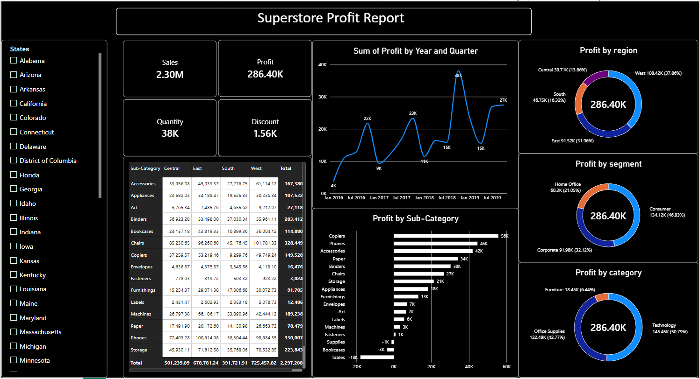

# Superstore Profit Report (Power BI)

An interactive Power BI dashboard that shows where a retail business makes and loses profit across regions, segments, categories and sub-categories.

<!-- Add your exported screenshot to this repo and name it dashboard.png -->

## Business questions answered
- How much do we sell, and how much of it turns into profit?
- Which regions, customer segments and product categories drive profit?
- Which sub-categories lose money?
- How does profit change over time (by year and quarter)?

## Dashboard contents
- **KPI cards:** Sales, Profit, Quantity, Discount
- **Line chart:** profit by year and quarter
- **Donut charts:** profit by region, segment and category
- **Bar chart:** profit by sub-category
- **Matrix:** sub-category by region
- **Slicer:** filter the whole report by state

## Key insights
- Total sales are about **2.30M** with a profit of about **286.4K**, a margin of roughly **12.5%**.
- **West** is the top region at about 108.4K (38% of profit), followed by East at about 91.5K (32%).
- **Technology** produces about **51%** of profit, and **Office Supplies** about 43%. **Furniture** contributes only about 6%.
- **Consumer** is the largest segment at about 47% of profit.
- **Tables** is the biggest loss-maker at about **-18K**, with Bookcases and Supplies also negative. These sub-categories are worth reviewing for pricing and discounts.

## Tools and skills
Power BI Desktop, data modelling, interactive visuals, slicers and filtering
<!-- Add what you actually used, for example: Power Query cleaning, DAX measures (list them) -->

## Dataset
Superstore sales data (Orders table).
<!-- Add where you downloaded the dataset from -->

## What I would improve next
- Add Profit Margin % and Average Discount % as KPI cards
- Replace the repeated donut charts with clearer bar charts
- Turn the state list into a dropdown slicer
